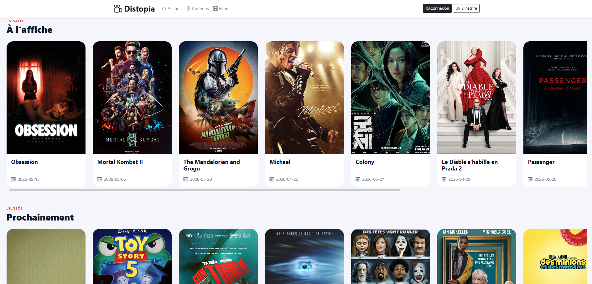
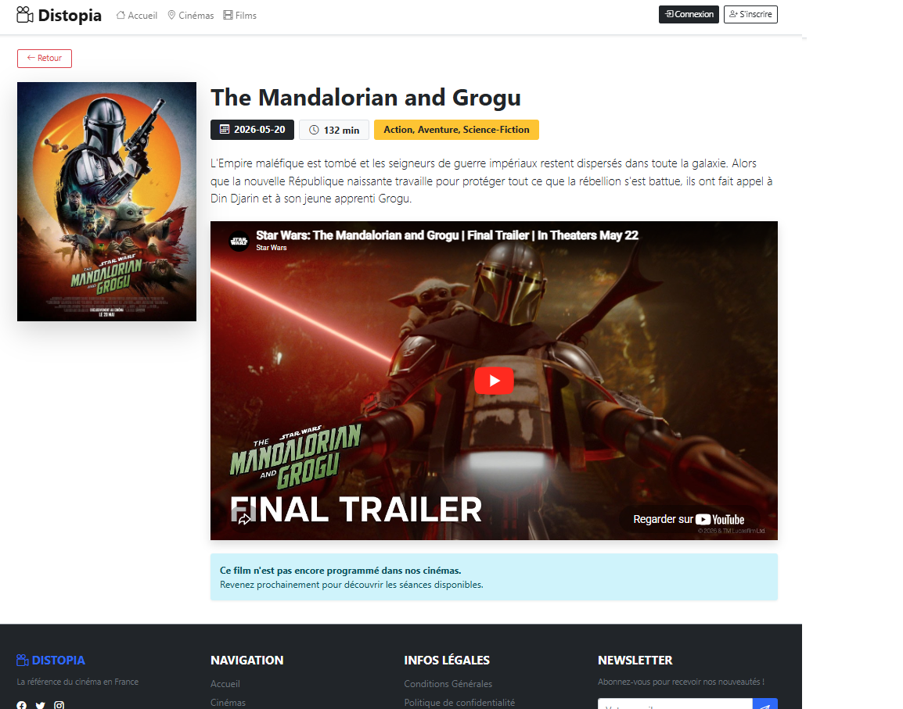
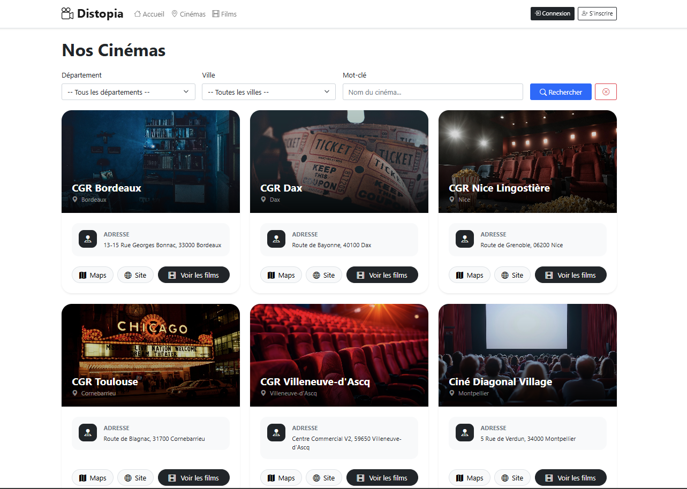
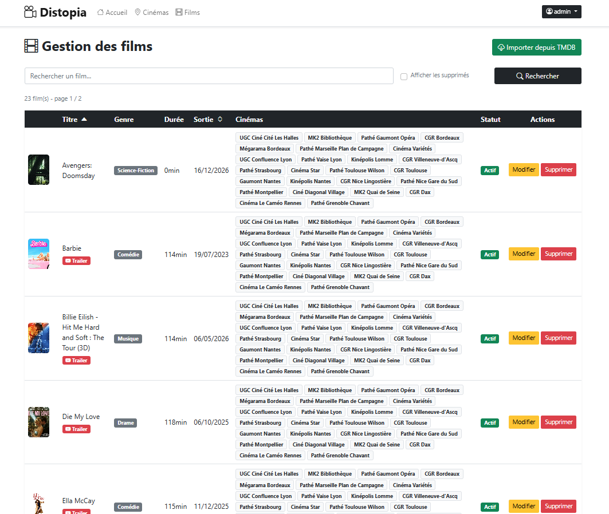
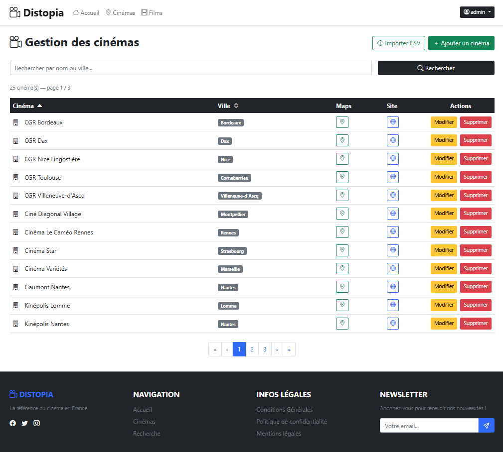
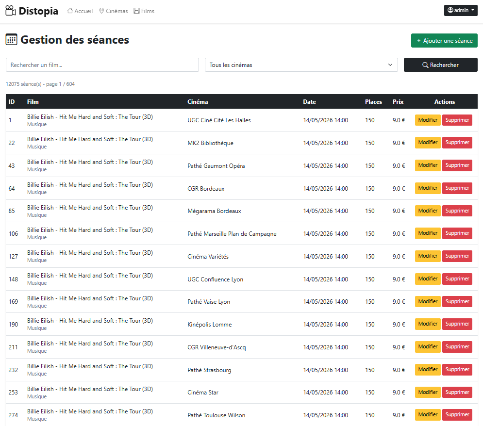

# Distopia

Application web de gestion d'un parc de cinémas, développée dans le cadre d'une évaluation  
Spring Boot / JPA / Thymeleaf

## Table des matières
- [Présentation](#présentation)
- [Fonctionnalités](#fonctionnalités)
- [Architecture](#architecture)
- [Technologies](#technologies)
- [Installation](#installation)
- [Configuration](#configuration)
- [Utilisation](#utilisation)
- [Structure du projet](#structure-du-projet)
- [Documentation](#documentation)
- [Tests](#tests)
- [Screenshots](#screenshots)
- [Sécurité](#sécurité)

## Présentation

Distopia est une application web permettant de consulter et gérer un parc de cinémas répartis en France.  
Les visiteurs peuvent consulter les films, les cinémas, les séances dipsonibles et accéder aux informations issues
de l'API TMDB.  
Les utilisateurs connectés peuvent réserver une ou plusieurs places pour une séance donnée et voir leurs réservations.  
L'administrateur dispose d'une interface complète pour gérer les villes, les cinémas, les films, les séances, ainsi que les
imports depuis TMDB (API) et CSV.

> L'authentification est gérée avec Spring Security, session HTTP et hachage des mots de passe avec BCrypt
---

## Fonctionnalités

### Visiteur (non connecté) 
- Consulter la page d'acceuil avec les films TMDB:
  - films à l'affiche
  - sorties de la semaine
  - films prochainement disponibles
- Consulter les Cinémas
- Consulter la liste des films
- Voir les détails d'un film 
- Consulter les **séances disponibles**
- S'inscrire / Se connecter

### Utilisateur connecté
- **Réserver une ou plusieurs places** pour une séance (avec contrôle du nombre de places dispos)
- Consulter l'**historique de ses réservations**

### Administrateur
- Gérer les **Villes** : ajouter, modifier, supprimer (les cinémas associés conservent leur existence, leur ville passe à `null`)
- Gérer les **Cinémas** : ajouter, modifier, supprimer, associer à une ville, importer depuis un fichier CSV
- Gérer les **Films** : ajouter, modifier, suppression logique (*soft delete* -le film reste en bdd), importer depuis TMDB
- Gérer les **Séances** : ajouter, modifier, supprimer (bloqué si des réservations existent)
- Générer automatiquement des séances fictives pour les films importés
- Importer automatiquement des films actuellement à l'affiche depuis TMDB
---

## Architecture

L'application suit une **architecture MVC multi-couches** :

### Couches principales

- **Web Layer** : contrôleurs Spring MVC
- **Form Layer** : objets de formulaire validés avec Jakarta Validation
- **Service Layer** : logique métier
- **Data Access Layer** : repositories Spring Data JPA
- **Domain Layer** : entités JPA
- **External API Layer** : client TMDB
- **Exception Layer** : exceptions métier et gestion globale des erreurs

### Validation

Les formulaires principaux utilisent des objets dédiés :

- `RegisterForm`
- `CinemaForm`
- `MovieForm`
- `SeanceForm`
- `TownForm`

Ces objets permettent de valider les entrées utilisateur avant d'appeler les services métier

### Gestion des erreurs

L'application utilise un `GlobalExceptionHandler` pour centraliser certaines erreurs :

- erreurs de validation de paramètres
- erreurs métier non interceptées localement
- erreurs inattendues

Les formulaires utilisent aussi `BindingResult` pour rediriger l'utilisateur avec un message d'erreur clair en cas de donnée invalide

---

## Technologies

| Composant           | Technologie                                |
|---------------------|--------------------------------------------|
| **Langage**         | Java 17                                    |
| **Framework**       | Spring Boot 3.5.6                          |
| **Web**             | Spring MVC                                 |
| **Vue**             | Thymeleaf + Thymeleaf Layout               |
| **ORM**             | Spring Data JPA / Hibernate                |
| **Sécurité**        | Spring Security                            |
| **Validation**      | Jakarta Validation                         |
| **Base de données** | MariaDB                                    |
| **API externe**     | TMDB API                                   |
| **Frontend**        | Bootstrap 5.3, Bootstrap Icons, JavaScript |
| **Build**           | Maven                                      |
| **Tests**           | JUnit 5, Mockito, AssertJ, MockMvc         |
| **Couverture**      | JaCoCo                                     |
| **IDE**             | IntelliJ IDEA                              |

---

## Installation

### 1. Cloner le dépôt

```bash
git clone https://github.com/john7440/Distopia.git
```

### 2. Ouvrir dans IntelliJ IDEA

1. `File` -> `Open` -> Sélectionner le dossier du projet
2. Attendre qu'IntelliJ indexe le projet et télécharger les dépendances Maven
3. Vérifier que `pom.xml` est bien reconnu

### 3. Vérifier Java

```bash
java -version
```
### 4. Installer les dépendances

```bash
mvn clean install
```
Note: commande disponible si Maven est installé sinon utiliser le wrapper `.\mvnw`

## Configuration

La configuration principale se trouve dans:
`src/main/resources/application.properties`

Example:
```bash
spring.application.name=Distopia

# Database
spring.datasource.url=jdbc:mariadb://localhost:3308/distopia2?createDatabaseIfNotExist=true
spring.datasource.username=root
spring.datasource.password=${DB_PASS}
spring.datasource.driver-class-name=org.mariadb.jdbc.Driver

# JPA
spring.jpa.hibernate.ddl-auto=update
spring.jpa.show-sql=false

# Thymeleaf
spring.thymeleaf.cache=false

# TMDB API
tmdb.api.key=${TMDB_API_KEY}
```

### Variables d'environnement nécessaires
Le projet utilise des variables d'environnement pour éviter de stocker les mots de passe et clés API dans le code:
- DB_PASS = Mot de passe MariaDB
- TMDB_API_KEY = clé API TMDB


#### Le projet utilise deux sources de données externes :

1. un fichier CSV local pour importer les cinémas 
2. l'API TMDB pour rechercher/importer des films

> Sans clé API TMDB, il reste possible d'ajouter des films manuellement depuis l'interface d'administration, mais l'import automatique depuis TMDB ne fonctionnera pas

### Import des cinémas depuis CSV

Les cinémas peuvent être importés depuis un fichier CSV déjà présent dans le projet :

```text
src/main/resources/data/cinemas.csv
```

L'import est lancé depuis l'interface administrateur: `/admin/cinemas`

Le bouton Importer CSV appelle le service CinemaCsvImporter, qui lit le fichier CSV, crée les villes si nécessaire, ignore les doublons et ajoute les cinémas en base.

### Ajout des films

Les films peuvent être ajoutés de deux manières :

1. Ajout manuel

L'administrateur peut créer ou modifier des films depuis: `/admin/movies`

> Cette méthode ne nécessite pas de clé API TMDB !

2. Import depuis TMDB

L'administrateur peut rechercher et importer des films depuis TMDB via: `/admin/import-movies`

> Pour cette méthode il faut une clé API TMDB à renseigner dans la variable d'environnement TMDB_API_KEY

Lors de l'import TMDB, l'application récupère automatiquement :
- le titre 
- la description 
- la durée 
- le genre 
- l'affiche 
- la date de sortie 
- la bande-annonce 
- l'identifiant TMDB

Note : L'identifiant TMDB est stocké en base afin d'éviter les confusions entre les films locaux et les films issus de l'API

### Génération automatique des séances

Lorsqu'un film est importé depuis TMDB, l'application peut générer automatiquement des séances fictives pour les cinémas disponibles

> L'administrateur peut aussi lancer un import automatique des films actuellement à l'affiche, accompagné de la génération automatique des séances, depuis l'interface d'administration

--- 
## Utilisation

### Lancer l'application

**Option A - IntelliJ IDEA :**

Naviguer vers `src/main/java/fr/fms/Distopia/DistopiaApplication.java`  
Clic droit -> `Run 'DistopiaApplication.main()'`

**Option B - Maven :**

```bash
mvn spring-boot:run
```
Puis ouvrir votre navigateur à l'adresse : [http://localhost:8080/index](http://localhost:8080/index)

### Tableau des routes

| Route                | Accès    | Description                                |
|----------------------|----------|--------------------------------------------|
| `/index`             | Tous     | Page d'accueil                             |
| `/cinemas`           | Tous     | Liste des cinémas                          |
| `/movies?cinemaId=x` | Tous     | Films d'un cinéma                          |
| `/seances?movieId=x` | Tous     | Séances d'un film                          |
| `/my-reservations`   | Connecté | Historique des réservations                |
| `/reserve` (POST)    | Connecté | réserver une ou plusieurs places           |
| `/admin/towns`       | Admin    | Gestion des villes                         |
| `/admin/cinemas`     | Admin    | Gestion des cinéma                         |
| `/admin/movies`      | Admin    | Gestion des films                          |
| `/admin/seances`     | Admin    | Gestion des séances                        |

---

## Structure du projet

```text
src
├── main
│   ├── java
│   │   └── fr.fms.Distopia
│   │       ├── config
│   │       ├── dao
│   │       ├── entities
│   │       ├── exceptions
│   │       ├── service
│   │       ├── tmdb
│   │       │   └── dto
│   │       ├── utils
│   │       └── web
│   │           └── form
│   └── resources
│       ├── static
│       ├── templates
│       ├── data
│       └── application.properties
└── test
    └── java
        └── fr.fms.Distopia
```
### Pacakages principaux

| Package      | Rôle                          |
| ------------ | ----------------------------- |
| `config`     | Configuration Spring Security |
| `dao`        | Repositories JPA              |
| `entities`   | Entités JPA                   |
| `exceptions` | Exceptions métier             |
| `service`    | Logique métier                |
| `tmdb`       | Client API TMDB               |
| `tmdb.dto`   | DTO de désérialisation TMDB   |
| `utils`      | Utilitaires de session        |
| `web`        | Contrôleurs MVC               |
| `web.form`   | DTO de formulaires validés    |

---

## Documentation
La documentation du projet contiens les diagrammes suivants:
- Diagramme de Use Case
- Diagramme de Classe avec les entitées principales
- Diagramme de Séquence:
  - Inscription Utilisateur
  - Reservation Séance pour un film
  - Import de film Tmdb
  - Validation formulaire Admin
- Diagramme de couches de l'application
- Diagramme des modules fonctionnels

## Tests

Le projet contient des tests unitaires et MVC

### Pour lancer les tests
```bash
mvn test
```
![Resultats Tests]
### Générer le rapport Jacoco
```bash
mvn clean verify
```
Le rapport est généré dans:
`target/site/jacoco/index.html`

### Tests end-to-end

Le projet inclus également des tests Selenium pour:
- la navigation de la page d'acceuil
- l'inscription d'un nouvel utilisateur
- la réservation d'une séance pour un utilisateur connecté
- la navigation admin

### Outils utilisés
- JUnit 5
- Mockito
- AssertJ
- MockMvc
- JaCoCo
- Selenium
- h2database

## Screenshots

### Page d'acceuil



### Détails d'un film



### Cinemas



### Admin movies



### Admin cinemas



### Admin seances



## Sécurité

L'application utilise Spring Security.

Règles principales :
- les pages publiques sont accessibles sans authentification
- les réservations nécessitent un utilisateur connecté
- les routes /admin/** nécessitent le rôle ADMIN

Les mots de passe sont hachés avec BCrypt

# Licence

Ce projet est réalisé dans le cadre d'un exercice d'évaluation Spring Boot / JPA / Thymeleaf et est destiné à des fins pédagogiques uniquement.
© 2026 [Jonathan Maier](https://github.com/john7440)
